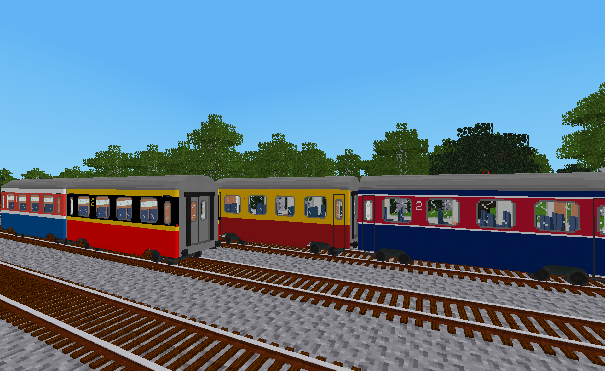

# Classic Coaches Nationality Livery Pack

This mod adds 25 nationality themed predefined liveries for wagons in the **Classic Coaches** mod.

This is a "light weight" livery pack in that it only contains additional predefined liveries and no livery templates.  As a light weight livery pack, it can be can be added to a game, have its liveries applied to some wagons and then later be removed from the game without causing any problems.  The updated wagons will retain their liveries even though the mod was removed from the game.  That is not the case for standard livery packs.

## Liveries

The 25 predefined liveries in this mod are based on livery templates from the **Classic Coaches Generic Livery Pack** and can be applied to wagons from the **Classic Coaches** mod using the livery designer tool from the **AdvTrains Livery Tools modpack**.

The nationalities for these liveries were selected based on the 25 largest national railway networks as listed on [Wikipedia](https://en.wikipedia.org/wiki/List_of_countries_by_rail_transport_network_size) at the time this mod was created.  The colors for each nation were selected based on official national flag colors, also as reported on Wikipedia.  The livery designs are fictional and not intended to correspond to any actual railways.

For mod developers, this mod is also intended to serve as an example of how to implement a light weight livery pack.

## Licenses

Copyright © 2023 Marnack

- Classic Coaches Nationality Livery Pack code is licensed under the GNU AGPL version 3 license, see [LICENSE.txt](LICENSE.txt) for details.
- Unless otherwise specified, Classic Coaches Nationality Livery Pack media (textures and images) are licensed under [CC BY-SA 3.0 Unported](https://creativecommons.org/licenses/by-sa/3.0/).

